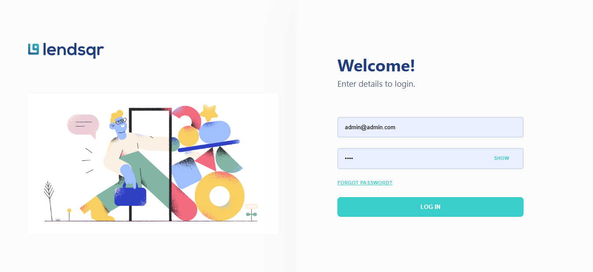

# Lendsqr Assessment

1. **Project Overview**
   - Short description of the project.  
     A frontend assessment app that simulates an admin console for lenders. Built with React + TypeScript and SCSS modules, it demonstrates component architecture, responsive layouts, test coverage and deployment-readiness.
   - Main features/pages implemented.
     - Login (src/pages/Login) — authentication UI with inline error handling.
     - Dashboard (src/pages/Dashboard) — app shell, fixed header and summary widgets.
     - User List (src/pages/UserList) — paginated, filterable table with row actions.
     - User Details (src/pages/UserDetails) — detailed user profile pages.
     - Shared components (src/components) and navigation data (src/components/SideBar/SideNavData.tsx).
     - Unit tests using Vitest + Testing Library (src/setupTests.ts).

2. **Features**
   - Persistent mock data seeded at bootstrap and saved to localStorage.
   - Login flow with inline error banner and simple validation.
   - Dashboard with navigation and widget placeholders.
   - Paginated and filterable user table with actions.
   - Detailed user profile view grouped into categories.
   - Responsive mobile/desktop behavior using react-responsive.
   - Unit tests for key components and flows.
   - Accessibility-minded markup (roles, alt text) and ARIA attributes in key controls.

3. **Tech Stack**
   - React (TypeScript)
   - Vite (dev & build)
   - SCSS modules for styling
   - React Router for client routing
   - react-responsive for breakpoint detection
   - nanoid for id generation
   - clsx for conditional class names
   - Vitest + @testing-library/react for unit tests
   - Browser APIs: ResizeObserver (used for dynamic header measurement)
   - Netlify Serverless Functions (for secure API calls)

4. **Installation & Setup**
   - Prerequisites:
     - Node.js (v16+ recommended), npm or pnpm
   - Open the project folder on your machine:
     - `d:\lendsqr\lendsqr-assessment`
   - Install dependencies:
     ```sh
     npm install
     # or
     pnpm install
     ```
   - Run in development (frontend only):
     ```sh
     npm run dev
     ```
   - Build for production:
     ```sh
     npm run build
     ```
   - Preview production build:
     ```sh
     npm run preview
     ```
   - Run unit tests:
     ```sh
     npm run test
     npm run test:watch
     ```

5. **Serverless Functions with Netlify**
   - Functions are used as a secure backend layer for fetching API data with authorization keys **kept on the server side**.
   - **Folder structure**:
     ```
     netlify/
       functions/
         fetchUser.ts
     ```
   - **Example function** (`netlify/functions/fetchUser.ts`):

     ```ts
     import type { Handler } from "@netlify/functions";

     export const handler: Handler = async () => {
       try {
         const response = await fetch(
           "https://api.json-generator.com/templates/BNHHyXQHClhi/data",
           {
             headers: {
               Authorization: `Bearer ${process.env.USERS_DATA_API}`,
               "Content-Type": "application/json",
             },
           },
         );

         const data = await response.json();

         return {
           statusCode: response.status,
           body: JSON.stringify(data),
         };
       } catch (error: any) {
         return {
           statusCode: 500,
           body: JSON.stringify({ error: error.message }),
         };
       }
     };
     ```

   - **Configuration (`netlify.toml`)**:

     ```toml
     [build]
       command = "pnpm build"
       publish = "dist"

     [functions]
       directory = "netlify/functions"
       node_bundler = "esbuild"
     ```

   - **Running locally**:
     ```sh
     netlify dev
     ```
     This starts both the Vite frontend (http://localhost:5173) and Netlify functions (http://localhost:8888).
   - **Frontend usage**:
     ```ts
     const response = await fetch("/.netlify/functions/fetchUser");
     const data = await response.json();
     ```
   - **Environment variables**:
     - Create a `.env` file (never commit to Git):
       ```
       USERS_DATA_API=your_api_key_here
       ```
     - Netlify auto-injects these on build & deploy.
   - Note: You **do not need to expose keys** in frontend code — they stay private on the Netlify backend.

6. **Project Structure**
   - Top-level files:
     - README.md — this file
     - package.json — scripts & dependencies
     - tsconfig.json — TypeScript configuration
     - vite.config.ts — Vite configuration
     - netlify.toml — Netlify build & function config
     - netlify/functions — Netlify server less functions logic
   - src/
     - App.tsx — routing and initial bootstrap
     - main.tsx — app entry
     - setupTests.ts — test setup
     - assets/ — images & icons used across the app
     - components/ — reusable UI primitives and shared components
       - SideBar/ — sidebar, SideNavData.tsx, styles and tests
       - Loading.tsx, ProtectRoute.tsx, CardDetails.tsx, etc.
     - pages/
       - Login/ — Login.tsx, Login.module.scss, Login.test.tsx
       - Dashboard/ — Dashboard.tsx, Dashboard.module.scss, Dashboard.test.tsx
       - UserList/ — UserList.tsx, UserList.module.scss, UserList.test.tsx
       - UserDetails/ — UserDetalls.tsx, UserDetails.module.scss, UserDetails.test.tsx
   - public/ — static files served by Vite (if present)

7. **Testing**
   - What was tested:
     - Login form validation and inline error banner behavior.
     - Navigation flows and useNavigate mocking for route assertions.
     - Rendering of core components (Dashboard, UserList, UserDetails).
     - Responsive behaviors via mocked breakpoints in tests.
   - How to run tests:
     ```sh
     npm run test
     npm run test:watch
     ```
   - Test tooling:
     - Vitest with @testing-library/react; see `src/setupTests.ts`.

8. **Design Considerations**
   - Accessibility:
     - Semantic HTML, alt text for icons and roles for alert regions; aria attributes added where applicable.
   - Responsiveness:
     - SCSS modules + react-responsive runtime detection.
   - Component reusability:
     - Shared components in `src/components`.
   - Error handling:
     - Inline error banners with constrained max-height.
   - Pixel fidelity:
     - Figma values preserved in SCSS; dynamic offsets used.

9. **Challenges & Solutions**
   - Sidebar clipping on mobile → fixed with ResizeObserver & dynamic inline styles.

- Header overlap with content → fixed with runtime height calculation and padding adjustments.
- Serverless functions not found locally → fixed by linking the project to Netlify using `netlify init` or an existing project; `netlify dev` then serves both frontend and functions correctly.
- NOTE → local functions cannot work independently without Netlify knowing the project context.

10. **Screenshots / Demo**

- Live sample image:  
  

- Live demo: [https://olawale-dayo-ibrahim-lendsqr-fe-test.netlify.app](https://olawale-dayo-ibrahim-lendsqr-fe-test.netlify.app)

---

Quick tester credentials

- Email: `admin@admin.com`
- Password: `Test`

Key files referenced

- src/App.tsx — routing and bootstrap
- src/pages/Login/Login.tsx — login UI & logic
- src/pages/Dashboard/Dashboard.tsx — header & mobile sidebar logic
- src/components/SideBar/SideNavData.tsx — navigation dataset
- src/setupTests.ts — test environment setup
