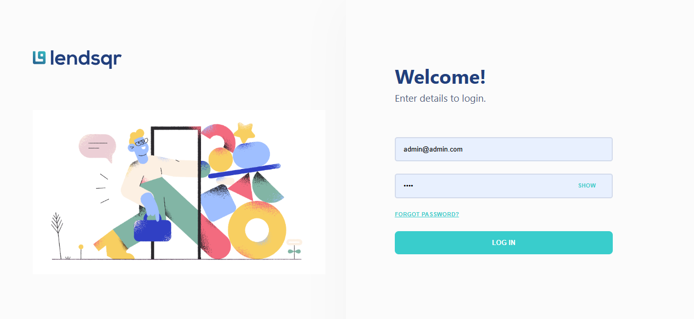

# Lendsqr Assessment

1. **Project Overview**
   - Short description of the project.  
     A frontend assessment app that simulates an admin console for lenders. Built with React + TypeScript and SCSS modules, it demonstrates component architecture, responsive layouts, test coverage and deployment-readiness.
   - Main features/pages implemented.
     - Login (src/pages/Login) — authentication UI with inline error handling.
     - Dashboard (src/pages/Dashboard) — app shell, fixed header and summary widgets.
     - User List (src/pages/UserList) — paginated, filterable table with row actions.
     - User Details (src/pages/UserDetails) — detailed user profile pages.
     - Shared components (src/components) and navigation data (src/components/SideBar/SideNavData.tsx).
     - Unit tests using Vitest + Testing Library (src/setupTests.ts).

2. **Features**
   - Persistent mock data seeded at bootstrap and saved to localStorage.
   - Login flow with inline error banner and simple validation.
   - Dashboard with navigation and widget placeholders.
   - Paginated and filterable user table with actions.
   - Detailed user profile view grouped into categories.
   - Responsive mobile/desktop behavior using react-responsive.
   - Unit tests for key components and flows.
   - Accessibility-minded markup (roles, alt text) and ARIA attributes in key controls.

3. **Tech Stack**
   - React (TypeScript)
   - Vite (dev & build)
   - SCSS modules for styling
   - React Router for client routing
   - react-responsive for breakpoint detection
   - nanoid for id generation
   - clsx for conditional class names
   - Vitest + @testing-library/react for unit tests
   - Browser APIs: ResizeObserver (used for dynamic header measurement)

4. **Installation & Setup**
   - Prerequisites:
     - Node.js (v16+ recommended), npm or pnpm
   - Open the project folder on your machine:
     - d:\lendsqr\lendsqr-assessment
   - Install dependencies:
     - npm install
     - or pnpm install
   - Run in development:
     - npm run dev
   - Build for production:
     - npm run build
   - Preview production build:
     - npm run preview
   - Run unit tests:
     - npm run test
     - npm run test:watch (watch mode)

5. **Project Structure**
   - Top-level files:
     - README.md — this file
     - package.json — scripts & dependencies
     - tsconfig.json — TypeScript configuration
     - vite.config.ts — Vite configuration
   - src/
     - App.tsx — routing and initial bootstrap
     - main.tsx — app entry
     - setupTests.ts — test setup
     - assets/ — images & icons used across the app
     - components/ — reusable UI primitives and shared components
       - SideBar/ — sidebar, SideNavData.tsx, styles and tests
       - Loading.tsx, ProtectRoute.tsx, CardDetails.tsx, etc.
     - pages/
       - Login/ — Login.tsx, Login.module.scss, Login.test.tsx
       - Dashboard/ — Dashboard.tsx, Dashboard.module.scss, Dashboard.test.tsx
       - UserList/ — UserList.tsx, UserList.module.scss, UserList.test.tsx
       - UserDetails/ — UserDetalls.tsx, UserDetails.module.scss, UserDetails.test.tsx
   - public/ — static files served by Vite (if present)
   - Notes:
     - Navigation data: src/components/SideBar/SideNavData.tsx
     - Tests live alongside components/pages with deterministic fixtures where needed.

6. **Testing**
   - What was tested:
     - Login form validation and inline error banner behavior.
     - Navigation flows and useNavigate mocking for route assertions.
     - Rendering of core components (Dashboard, UserList, UserDetails).
     - Responsive behaviors via mocked breakpoints in tests.
   - How to run tests:
     - npm run test
     - npm run test:watch
   - Test tooling:
     - Vitest with @testing-library/react; see src/setupTests.ts for global test setup.

7. **Design Considerations**
   - Accessibility:
     - Semantic HTML, alt text for icons and roles for alert regions; aria attributes added to interactive controls where applicable.
   - Responsiveness:
     - SCSS modules include breakpoint-specific rules; runtime breakpoint detection uses react-responsive.
   - Component reusability:
     - Reusable components live in src/components to enable composition and easier testing.
   - Error handling:
     - Inline error banners with constrained max-height and internal scrolling to avoid layout shifts; controlled navigation prevents unvalidated redirects.
   - Pixel fidelity:
     - Figma pixel values preserved in SCSS; dynamic header/sidebar offsets measured at runtime to avoid brittle hardcoded offsets.

8. **Challenges & Solutions**
   - Sidebar clipping on mobile:
     - Cause: fixed/relative positioning combined with max-height and padding pushed last items out of view.
     - Fix: measure header bottom at runtime (ResizeObserver) and set mobile sidebar top/height inline; let inner .SideMenu handle overflow with overflow-y:auto and avoid max-height caps. Use padding-bottom instead of last-child margins to avoid clipping.harness.
   - Header overlap with content:
     - Cause: fixed header overlaying following content with varying heights.
     - Fix: compute header height and expose via SCSS variable or inline offsets; use padding-top or top values derived at runtime.

9. **Future Improvements**
   - Replace localStorage mock data with a real paginated API backend.
   - Add end-to-end tests (Playwright/Cypress) to cover full user flows.
   - Introduce Storybook and visual regression tests.
   - Improve accessibility audit (automated axe checks) and add keyboard-only navigation tests.
   - Add role-based access control and server-side authentication.

10. **Screenshots / Demo**

- Live sample image:
  

- Live demo: [https://olawale-dayo-ibrahim-lendsqr-fe-test.netlify.app](https://olawale-dayo-ibrahim-lendsqr-fe-test.netlify.app)

---

Quick tester credentials

- Email: `admin@admin.com`
- Password: `Test`

Key files referenced

- src/App.tsx — routing and bootstrap
- src/pages/Login/Login.tsx — login UI & logic
- src/pages/Dashboard/Dashboard.tsx — header & mobile sidebar logic
- src/components/SideBar/SideNavData.tsx — navigation dataset
- src/setupTests.ts — test environment setup
